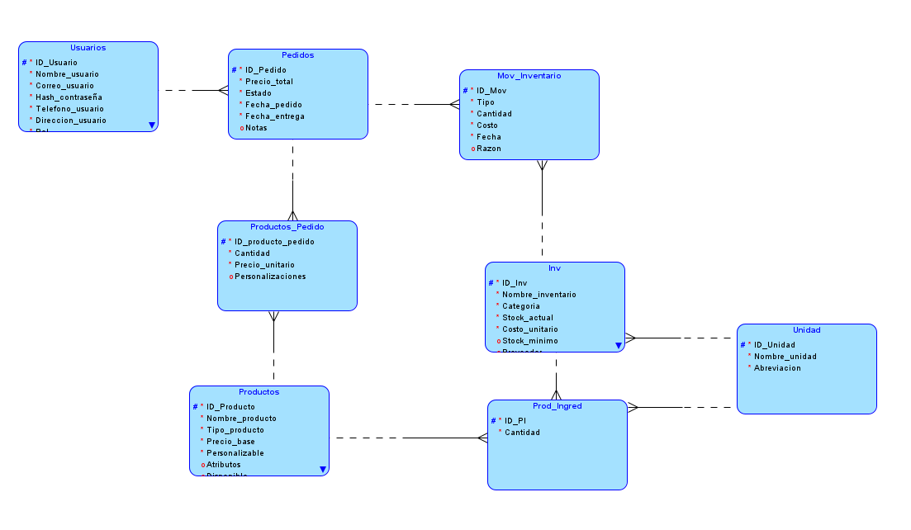
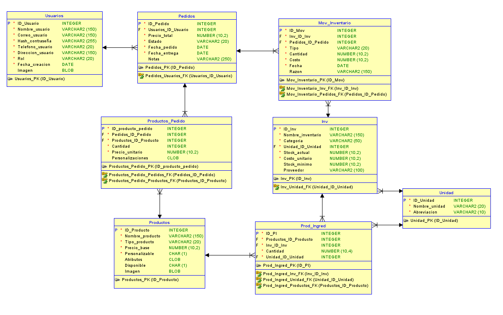

# Manual Técnico — La Cazuela Chapina

Este documento describe la arquitectura, configuración, compilación y ejecución del proyecto "La Cazuela Chapina" para desarrolladores.

Requisitos
--------------
- .NET SDK 8.0 (o runtime 8.0 en producción)
- Node.js 18+ y npm (para generar el build del frontend)
- Oracle DB (o equivalente) si se quiere ejecutar la base de datos localmente
- Clave para OpenRouter para la parte de llm

Variables de entorno importantes (.env)
----------------------------------
- `OPENROUTER_API_KEY` — clave para el proxy LLM en el backend (opcional).
- `VITE_API_URL` (opcional) — URL del backend para el frontend (si se configura vía `.env` en `Frontend/`).
- Variables de conexión a la BD usadas por `Program.cs` (revisar `Backend/Program.cs` para nombres concretos; puede estar embebida en la cadena de conexión).

Backend (.NET)
-------------------

Ubicación: `Backend/`.

Endpoints claves (ejemplos):

- `GET /api/products` — lista de productos
- `GET /api/products/{id}` — detalle producto
- `POST /api/products` — crear producto (admin)
- `GET /api/combos` — combos
- `POST /api/llm` — proxy al proveedor LLM (OpenRouter)
- `GET /api/admin/analytics` — KPIs y métricas

Notas de desarrollo:
- `Program.cs` es el punto principal; al editar endpoints revisar dependencias y Dapper/Oracle cliente que el proyecto usa.
- Si añades paquetes, usa `dotnet add package <package>` y actualiza la solución.

Base de datos (Oracle)
-------------------------
Modelo Lógico 
Modelo Entidad-Relación 

Si se quiere saber más información acerca de los atributos y relaciones, también se ofrece el diccionario de datos en `Documentacion/assets/DiccionarioDatos/`.

Los scripts SQL están en `BD/`:

- `BD.sql` — DDL principal para crear tablas.
- `constraints.sql` — constraints y secuencias.

Pasos básicos:

1. Abrir cliente Oracle (SQL Developer, SQL*Plus o DBeaver).
2. Ejecutar `BD/BD.sql` en el esquema objetivo.
3. Ejecutar `BD/constraints.sql` para crear constraints y triggers.
4. Importar CSVs de `Archivos de prueba/` si los necesitas (productos, inventario, unidad, pedidos).

Nota: los CSV asumen columnas concretas; revisa los encabezados antes de importar.

Frontend (React + Vite)
---------------------------
[Manual Usuario](Manual%20Usuario.md)

Ubicación: `Frontend/`.

Instalación y ejecución:

```powershell
cd ./Frontend
npm install
npm run dev
```

Configuración de la URL del backend:
- Puedes crear `Frontend/.env` con:

```
VITE_API_URL=http://localhost:5000
```

Y luego adaptar `AppContext.jsx` para leer `import.meta.env.VITE_API_URL` como `API_URL_DIRECT` (si no ya lo hace).

Comportamiento del chat y LLM en frontend:
- El chat en `Home.jsx` envía un `messages` array al endpoint `/api/llm` con un `system` prompt que pide JSON.
- La UI parsea la respuesta y la muestra al usuario; si la respuesta no es JSON válido, se añade como texto crudo.

Integración LLM (OpenRouter)
--------------------------------

El backend expone `/api/llm` que actúa como proxy a OpenRouter. Para usarlo:

1. Configura `$env:OPENROUTER_API_KEY` en tu entorno donde corre el backend.
2. El frontend envía `POST /api/llm` con `{ messages: [ ... ] }` y el backend reenvía al proveedor.


Despliegue y consideraciones
--------------------------------

Requisitos para producción
- .NET runtime 8.0 o superior (para ejecutar la aplicación publicada)
- Node.js (para generar el bundle del frontend)
- Base de datos Oracle accesible desde la infraestructura de producción
- Certificados TLS/SSL para HTTPS
- Un gestor de secretos o variables de entorno seguras

Despliegue sin contenedores (pasos resumidos)

1) Compilar backend:

```powershell
cd ./Backend
dotnet build
```
Crea tu .env:
```powershell
# Configuracion de ejemplo de variables de entorno para el backend de La Cazuela Chapina

# Oracle DB connection
ORACLE_DB_HOST=localhost
ORACLE_DB_PORT=1521
ORACLE_DB_SID=XE
ORACLE_DB_USER=oracle
ORACLE_DB_PASS=password

# Frontend url
FRONTEND_URL=http://localhost:5173

# OpenRouter API key
# Obtén una en https://openrouter.ai y pégala aquí
OPENROUTER_API_KEY=your_openrouter_api_key_here

# (Optional) Fallback to use OPENAI API key if you prefer
# OPENAI_API_KEY=your_openai_api_key_here
```

Salida esperada: la app escucha en `http://localhost:5000` y `https://localhost:5001` (revisar consola).


2) Compilar frontend:

```powershell
cd Frontend
npm install --production
npm run build
# El resultado se coloca típicamente en Frontend/dist (revisa vite.config.js)
```
